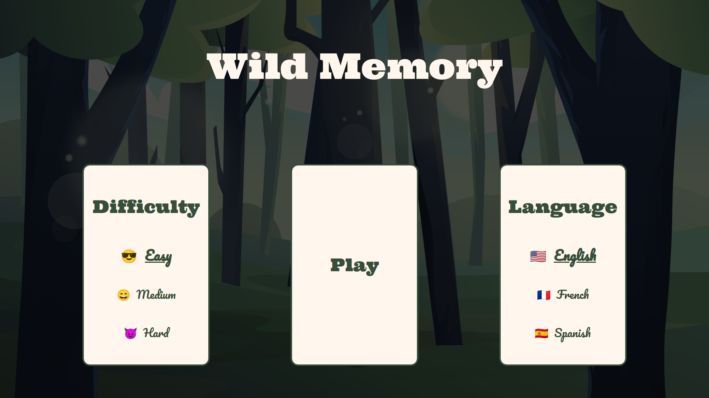
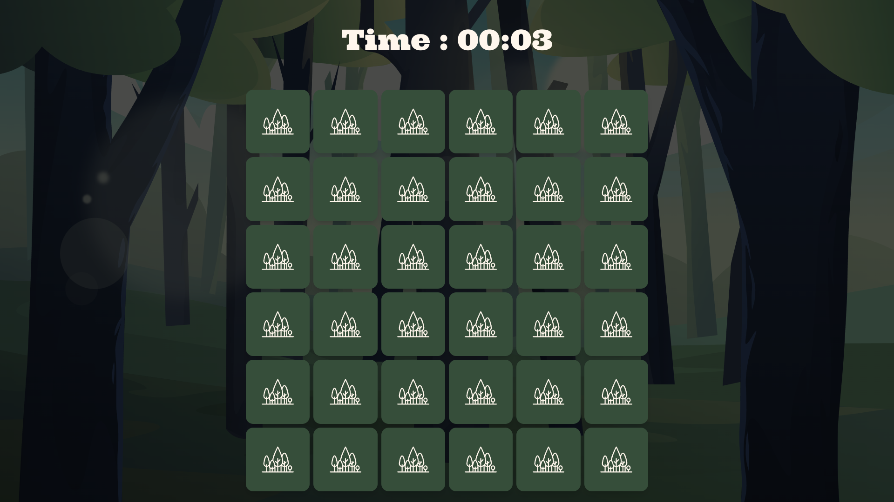
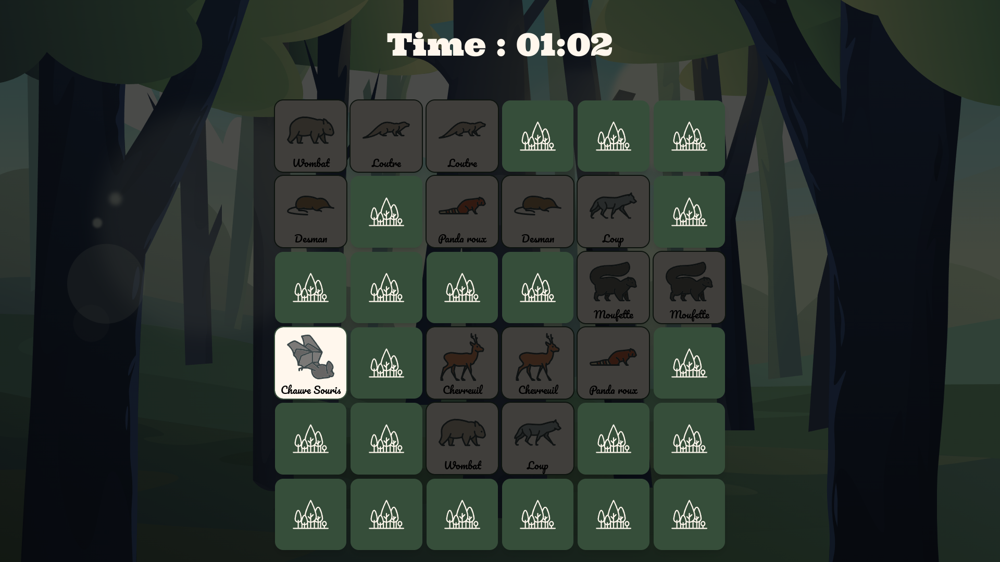
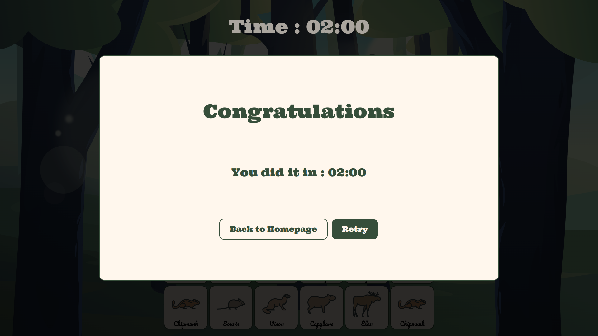

# Wild Memory

Wild memory is a little memory game in 3 different languages.  
It can be used as a tool to learn the names in English, French or Spanish of 50 different animals.

It can be found [here](https://memory.bbaloup.fr/) !

## Dependencies

- [Vue.js](https://vuejs.org/)
- [TailwindCSS](https://tailwindcss.com/)

## Main Features
### Difficulty Selection

On the HomePage you can choose between 3 difficulties that changes the number of cards in the game. 
 - *easy* with 16 cards
 - *medium* with 36 cards
 - *hard* with 64 cards

### Language Selection

As said in the introduction, you can choose on the homepage the languages of the cards between English, French or Spanish.

---

### The Game

The game have all the expected functions of memory game :
- You can click on any card to flip it.
- When 2 cards are flipped, if there is a match, the 2 cards will be eliminated from the game.
- If there isn't a match, the 2 cards will flip back.
- When all the matches have been found, you will see a dialog box showing a Congratulations message with a counter displaying the time it took to finish the game

## TODO

Making it mobile friendly